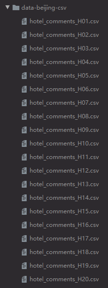
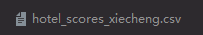
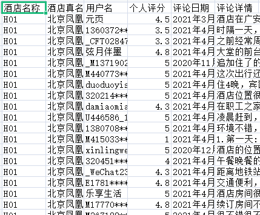
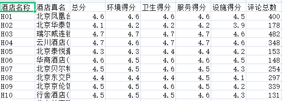

# xiecheng_hotel_reviews_spider
基于selenium的携程酒店评论爬取

## 本程序实现爬取100个酒店的评分，以及其评论及对应评分
### 评论保存文件
 
### 分数保存文件
 
### 结果展示-评论
 
### 结果展示-分数
 
 

### 1.运行前请确保selenium,pyquery,csv已经安装（selenium使用的Chrome浏览器）
### 2.将要爬取的酒店的hotel_id存入hotels列表
### 3.请自行修改save_dir_csv和save_dir_xlsx的值，并创建对应目录
### 4.酒店从hotel_code开始编号，初始为1，若中途中断后再运行，请修改编号开始值

